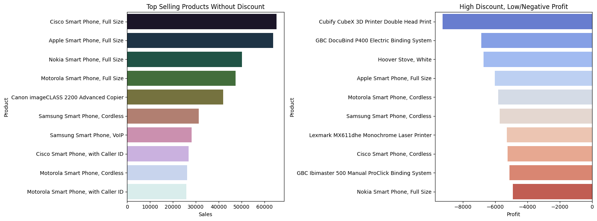

# Business Intelligence Case Study with GridDB and Python

How do you know your business is going in the right direction? 

With so much data we have in hand, it is very easy for the problem to get lost while cleaning and analysing it. To be honest, I was in the same place. As a Data Analyst/Data Scientist, I would try to look at the data first and make sense of it. But it not only consumed more time but also made it difficult to explain why I took certain decisions. 

A recent project on Business Intelligence taught me the power of problem-solving. For this tutorial, we will be exploring a dataset of a global store. To keep it general, I am going to assume our problem statment here is <code>How to grow our business</code>. Then, we will work through the problem statement in a tree-like framework. This will help in structuring our analysis and also get specific KPIs.

## Framework

The framework breaks this down into two major strategic approaches:

<div align="center">
  
</div>


### 1. Increase Our Profit

There are a few ways to boost profits. This framework highlights three core strategies:

➤ Increase the Quantity Sold
More units sold usually means more revenue. To do this effectively:
- **Ensure demand is met** – Make sure your supply chain and stock levels can support customer demand. We need more data to do this.
- **Focus on region-specific performance** – Some regions may outperform others, and identifying where sales are strongest helps target efforts better.

➤ Sell More Products with High Profit Margins
Not all products are created equal. Shifting focus toward high-margin items can improve profitability.
- Use **product-level** data to identify top performers.
- Understand **regional trends** to see where high-margin products sell best.

➤ Reduce the Shipping Cost
Shipping and logistics can quietly erode margins, so optimizing this is crucial.
- Analyze which **products** incur the highest shipping costs.
- Check which **regions** are driving those costs and explore smarter routing or fulfillment solutions.


### 2. Decrease Our Discount

While discounts can drive volume, excessive discounting eats into profits. Two key tactics can help manage this:

➤ Identify Best-Selling Products
Best-sellers may not need heavy discounting to move.
- Reassess discount policies at the **product** level.
- Consider performance variations across **regions**.

➤ Uncover Bottlenecks
Inefficiencies or slow-moving inventory often trigger unnecessary discounts.
- Identifying and addressing **bottlenecks** can reduce dependency on markdowns.


Now that we have a basic framework in place, let us look at each aspect and decide on the metrics.

## What metrics are we tracking?

1. Key Performance Indicators (KPIs): 
    - total sales
    - total profit
    - average shipping cost
    - average discount
2.  Profitability: 
    - products with most profit
    - regions with most profit
3. Discount:
    - best selling products (do not need discounts)
    - bottlenecks due to discounts (low or negative profit margin)
4. Market segmentation: Identifying customer patterns
    - quantity sold by region
    - profit by region
    - shipping cost by region
    - discount by region

## Pre-requisites

The following libraries are required for the below code to execute:

1. Pandas
2. GridDB Python Client
3. Seaborn
4. Matplotlib

GridDB's [GitHub Page](https://github.com/griddb/python_client) covers the installation in detail. Please go through it to be able to interact with the GridDB Server in Python.

Great! Let's go ahead and import the libraries

## Importing Libraries


```python
#this is optional - in case of errors during execution even though the python client is installed, it is likely that this could be a path issue and can be resolved as follows
import sys
sys.path.append("/home/shripriya/python_client")
#sys.path.append(<path_to_python_client>)
```


```python
import griddb_python as griddb
import pandas as pd
import seaborn as sns
import matplotlib.pyplot as plt
```

## Dataset

We will be using an open-source SuperStore dataset that can be downloaded from [here](https://powerbidocs.com/2019/11/28/power-bi-sample-data-set-for-practice/). Once we download it and put it in the same folder as the code, we can then use pandas to read it and clean it.

## Reading the Dataframe


```python
superstore_df = pd.read_excel("global_superstore_2016.xlsx", sheet_name="Orders")
superstore_df.head()
```


<div>
<style scoped>
    .dataframe tbody tr th:only-of-type {
        vertical-align: middle;
    }

    .dataframe tbody tr th {
        vertical-align: top;
    }

    .dataframe thead th {
        text-align: right;
    }
</style>
<table border="1" class="dataframe">
  <thead>
    <tr style="text-align: right;">
      <th></th>
      <th>Row ID</th>
      <th>Order ID</th>
      <th>Order Date</th>
      <th>Ship Date</th>
      <th>Ship Mode</th>
      <th>Customer ID</th>
      <th>Customer Name</th>
      <th>Segment</th>
      <th>Postal Code</th>
      <th>City</th>
      <th>...</th>
      <th>Product ID</th>
      <th>Category</th>
      <th>Sub-Category</th>
      <th>Product Name</th>
      <th>Sales</th>
      <th>Quantity</th>
      <th>Discount</th>
      <th>Profit</th>
      <th>Shipping Cost</th>
      <th>Order Priority</th>
    </tr>
  </thead>
  <tbody>
    <tr>
      <th>0</th>
      <td>40098</td>
      <td>CA-2014-AB10015140-41954</td>
      <td>2014-11-11</td>
      <td>2014-11-13</td>
      <td>First Class</td>
      <td>AB-100151402</td>
      <td>Aaron Bergman</td>
      <td>Consumer</td>
      <td>73120.0</td>
      <td>Oklahoma City</td>
      <td>...</td>
      <td>TEC-PH-5816</td>
      <td>Technology</td>
      <td>Phones</td>
      <td>Samsung Convoy 3</td>
      <td>221.980</td>
      <td>2</td>
      <td>0.0</td>
      <td>62.1544</td>
      <td>40.77</td>
      <td>High</td>
    </tr>
    <tr>
      <th>1</th>
      <td>26341</td>
      <td>IN-2014-JR162107-41675</td>
      <td>2014-02-05</td>
      <td>2014-02-07</td>
      <td>Second Class</td>
      <td>JR-162107</td>
      <td>Justin Ritter</td>
      <td>Corporate</td>
      <td>NaN</td>
      <td>Wollongong</td>
      <td>...</td>
      <td>FUR-CH-5379</td>
      <td>Furniture</td>
      <td>Chairs</td>
      <td>Novimex Executive Leather Armchair, Black</td>
      <td>3709.395</td>
      <td>9</td>
      <td>0.1</td>
      <td>-288.7650</td>
      <td>923.63</td>
      <td>Critical</td>
    </tr>
    <tr>
      <th>2</th>
      <td>25330</td>
      <td>IN-2014-CR127307-41929</td>
      <td>2014-10-17</td>
      <td>2014-10-18</td>
      <td>First Class</td>
      <td>CR-127307</td>
      <td>Craig Reiter</td>
      <td>Consumer</td>
      <td>NaN</td>
      <td>Brisbane</td>
      <td>...</td>
      <td>TEC-PH-5356</td>
      <td>Technology</td>
      <td>Phones</td>
      <td>Nokia Smart Phone, with Caller ID</td>
      <td>5175.171</td>
      <td>9</td>
      <td>0.1</td>
      <td>919.9710</td>
      <td>915.49</td>
      <td>Medium</td>
    </tr>
    <tr>
      <th>3</th>
      <td>13524</td>
      <td>ES-2014-KM1637548-41667</td>
      <td>2014-01-28</td>
      <td>2014-01-30</td>
      <td>First Class</td>
      <td>KM-1637548</td>
      <td>Katherine Murray</td>
      <td>Home Office</td>
      <td>NaN</td>
      <td>Berlin</td>
      <td>...</td>
      <td>TEC-PH-5267</td>
      <td>Technology</td>
      <td>Phones</td>
      <td>Motorola Smart Phone, Cordless</td>
      <td>2892.510</td>
      <td>5</td>
      <td>0.1</td>
      <td>-96.5400</td>
      <td>910.16</td>
      <td>Medium</td>
    </tr>
    <tr>
      <th>4</th>
      <td>47221</td>
      <td>SG-2014-RH9495111-41948</td>
      <td>2014-11-05</td>
      <td>2014-11-06</td>
      <td>Same Day</td>
      <td>RH-9495111</td>
      <td>Rick Hansen</td>
      <td>Consumer</td>
      <td>NaN</td>
      <td>Dakar</td>
      <td>...</td>
      <td>TEC-CO-6011</td>
      <td>Technology</td>
      <td>Copiers</td>
      <td>Sharp Wireless Fax, High-Speed</td>
      <td>2832.960</td>
      <td>8</td>
      <td>0.0</td>
      <td>311.5200</td>
      <td>903.04</td>
      <td>Critical</td>
    </tr>
  </tbody>
</table>
<p>5 rows × 24 columns</p>
</div>


We can see that our dataset has a lot of information on the orders being placed. Not all information is useful here. Remember our framework comes in handy here. So, we will go ahead and drop some columns that are not needed.

## Exploratory Data Analysis (EDA)


```python
#do not need Order ID, Postal Code, Order Priority
cols = ["Order ID", "Postal Code", "Order Priority"]
superstore_df.drop(columns=cols, inplace=True)
```


```python
superstore_df.info()
```

    <class 'pandas.core.frame.DataFrame'>
    RangeIndex: 51290 entries, 0 to 51289
    Data columns (total 21 columns):
     #   Column         Non-Null Count  Dtype         
    ---  ------         --------------  -----         
     0   Row ID         51290 non-null  int64         
     1   Order Date     51290 non-null  datetime64[ns]
     2   Ship Date      51290 non-null  datetime64[ns]
     3   Ship Mode      51290 non-null  object        
     4   Customer ID    51290 non-null  object        
     5   Customer Name  51290 non-null  object        
     6   Segment        51290 non-null  object        
     7   City           51290 non-null  object        
     8   State          51290 non-null  object        
     9   Country        51290 non-null  object        
     10  Region         51290 non-null  object        
     11  Market         51290 non-null  object        
     12  Product ID     51290 non-null  object        
     13  Category       51290 non-null  object        
     14  Sub-Category   51290 non-null  object        
     15  Product Name   51290 non-null  object        
     16  Sales          51290 non-null  float64       
     17  Quantity       51290 non-null  int64         
     18  Discount       51290 non-null  float64       
     19  Profit         51290 non-null  float64       
     20  Shipping Cost  51290 non-null  float64       
    dtypes: datetime64[ns](2), float64(4), int64(2), object(13)
    memory usage: 8.2+ MB


Since there are no null-values, we do not need to worry about that. However, the date columns here are not of the correct datatype. So we will quickly change that before inserting the data into GridDB.


```python
# Prepare the DataFrame
superstore_df["Order Date"] = pd.to_datetime(superstore_df["Order Date"]).dt.to_pydatetime()
superstore_df["Ship Date"] = pd.to_datetime(superstore_df["Ship Date"]).dt.to_pydatetime()

# Rename columns to match GridDB naming (no spaces or dashes)
superstore_df.columns = [col.replace(" ", "_").replace("-", "_") for col in superstore_df.columns]
```

    /tmp/ipykernel_1024/114528052.py:2: FutureWarning: The behavior of DatetimeProperties.to_pydatetime is deprecated, in a future version this will return a Series containing python datetime objects instead of an ndarray. To retain the old behavior, call `np.array` on the result
      superstore_df["Order Date"] = pd.to_datetime(superstore_df["Order Date"]).dt.to_pydatetime()
    /tmp/ipykernel_1024/114528052.py:3: FutureWarning: The behavior of DatetimeProperties.to_pydatetime is deprecated, in a future version this will return a Series containing python datetime objects instead of an ndarray. To retain the old behavior, call `np.array` on the result
      superstore_df["Ship Date"] = pd.to_datetime(superstore_df["Ship Date"]).dt.to_pydatetime()


Let us verify that the datatypes are indeed changed.


```python
superstore_df.info()
```

    <class 'pandas.core.frame.DataFrame'>
    RangeIndex: 51290 entries, 0 to 51289
    Data columns (total 21 columns):
     #   Column         Non-Null Count  Dtype         
    ---  ------         --------------  -----         
     0   Row_ID         51290 non-null  int64         
     1   Order_Date     51290 non-null  datetime64[ns]
     2   Ship_Date      51290 non-null  datetime64[ns]
     3   Ship_Mode      51290 non-null  object        
     4   Customer_ID    51290 non-null  object        
     5   Customer_Name  51290 non-null  object        
     6   Segment        51290 non-null  object        
     7   City           51290 non-null  object        
     8   State          51290 non-null  object        
     9   Country        51290 non-null  object        
     10  Region         51290 non-null  object        
     11  Market         51290 non-null  object        
     12  Product_ID     51290 non-null  object        
     13  Category       51290 non-null  object        
     14  Sub_Category   51290 non-null  object        
     15  Product_Name   51290 non-null  object        
     16  Sales          51290 non-null  float64       
     17  Quantity       51290 non-null  int64         
     18  Discount       51290 non-null  float64       
     19  Profit         51290 non-null  float64       
     20  Shipping_Cost  51290 non-null  float64       
    dtypes: datetime64[ns](2), float64(4), int64(2), object(13)
    memory usage: 8.2+ MB


Okay, everything looks great! We can now put our clean data into GridDB.

## Putting the data into GridDB

Before putting the data into GridDB, we need to create something called <code>containers</code>. Containers are like tables in any database. We define our schema that includes the name and data type of the column. Once we create the containers, it is very easy to put the data using the GridDB python client.

### Container Creation


```python
factory = griddb.StoreFactory.get_instance()
host = "127.0.0.1:10001"
cluster = "myCluster"
db_user = "admin"
db_password = "admin"

try:
    gridstore = factory.get_store(notification_member=host, cluster_name=cluster, username=db_user, password=db_password)
    print("Connection successful")

    conInfo = griddb.ContainerInfo(
        name="sales_data",
        column_info_list=[
            ["Row_ID", griddb.Type.LONG],
            ["Order_Date", griddb.Type.TIMESTAMP],
            ["Ship_Date", griddb.Type.TIMESTAMP],
            ["Ship_Mode", griddb.Type.STRING],
            ["Customer_ID", griddb.Type.STRING],
            ["Customer_Name", griddb.Type.STRING],
            ["Segment", griddb.Type.STRING],
            ["City", griddb.Type.STRING],
            ["State", griddb.Type.STRING],
            ["Country", griddb.Type.STRING],
            ["Region", griddb.Type.STRING],
            ["Market", griddb.Type.STRING],
            ["Product_ID", griddb.Type.STRING],
            ["Category", griddb.Type.STRING],
            ["Sub_Category", griddb.Type.STRING],
            ["Product_Name", griddb.Type.STRING],
            ["Sales", griddb.Type.DOUBLE],
            ["Quantity", griddb.Type.INTEGER],
            ["Discount", griddb.Type.DOUBLE],
            ["Profit", griddb.Type.DOUBLE],
            ["Shipping_Cost", griddb.Type.DOUBLE]
        ],
        type=griddb.ContainerType.COLLECTION
    )

    container = gridstore.put_container(conInfo)
    print("Container creation successful")


except griddb.GSException as e:
    for i in range(e.get_error_stack_size()):
        print("[", i, "]")
        print("Error Code:", e.get_error_code(i))
        print("Location:", e.get_location(i))
        print("Message:", e.get_message(i))

```

    Connection successful
    Container creation successful


If executed correctly, the above code should print out <code>Connection successful</code> followed by <code>Container creation successful</code>. If not, the exception message will help you troubleshoot. More information on the error codes are available [here](https://www.toshiba-sol.co.jp/en/pro/griddb/docs-en/v4_3_2/GridDB_ErrorCodes.html).

Once our container is in place, let us put the data into it using the following code.

### Inserting the data


```python
container.put_rows(superstore_df)
print("Data insertion successful")
```

    Data insertion successful


It is very important to verify if our data has been inserted correctly before moving onto the data analysis. Let's go ahead and do that.

### Reading the data


```python
try:
        gridstore = factory.get_store(notification_member=host, cluster_name=cluster, username=db_user, password=db_password)
        cont = gridstore.get_container("sales_data")
        if cont is None:
            print("Does not exist")
        print("Connection successful")
        
        query_str="SELECT *"
        query = cont.query(query_str)
        rs = query.fetch()
        df = rs.fetch_rows()
        print(df.info())

except griddb.GSException as e:
    for i in range(e.get_error_stack_size()):
        print("[",i,"]")
        print(e.get_error_code(i))
        print(e.get_location(i))
        print(e.get_message(i))
```

    Connection successful
    <class 'pandas.core.frame.DataFrame'>
    RangeIndex: 51290 entries, 0 to 51289
    Data columns (total 21 columns):
     #   Column         Non-Null Count  Dtype         
    ---  ------         --------------  -----         
     0   Row_ID         51290 non-null  int64         
     1   Order_Date     51290 non-null  datetime64[ns]
     2   Ship_Date      51290 non-null  datetime64[ns]
     3   Ship_Mode      51290 non-null  object        
     4   Customer_ID    51290 non-null  object        
     5   Customer_Name  51290 non-null  object        
     6   Segment        51290 non-null  object        
     7   City           51290 non-null  object        
     8   State          51290 non-null  object        
     9   Country        51290 non-null  object        
     10  Region         51290 non-null  object        
     11  Market         51290 non-null  object        
     12  Product_ID     51290 non-null  object        
     13  Category       51290 non-null  object        
     14  Sub_Category   51290 non-null  object        
     15  Product_Name   51290 non-null  object        
     16  Sales          51290 non-null  float64       
     17  Quantity       51290 non-null  int64         
     18  Discount       51290 non-null  float64       
     19  Profit         51290 non-null  float64       
     20  Shipping_Cost  51290 non-null  float64       
    dtypes: datetime64[ns](2), float64(4), int64(2), object(13)
    memory usage: 8.2+ MB
    None


Great! Everything looks great. We can now go ahead with our analysis.

# Analysis

I will define a function that takes the container, query, and output data type as an input and returns the result of the query. This helps me avoid writing the same code over and over again.


```python
def fetch_data(container, query_str, data_type):
    rs = container.query(query_str)
    row_set = rs.fetch()
    if row_set.has_next():
        result = row_set.next()
        result = result.get(type=data_type)
    
        return result
```

## 1. Key Performance Indicators (KPI)

Referencing the framework, we are tracking 4 KPIs -

1. Total Sales
2. Total Profit
3. Avg Shipping Cost
4. Avg Discount


```python
total_sales = fetch_data(cont, 'SELECT SUM(Sales) FROM sales_data', griddb.Type.DOUBLE)
total_profit = fetch_data(cont, 'SELECT SUM(Profit) FROM sales_data', griddb.Type.DOUBLE)
avg_shipping = fetch_data(cont, 'SELECT AVG(Shipping_Cost) FROM sales_data', griddb.Type.DOUBLE)
avg_discount = fetch_data(cont, 'SELECT AVG(Discount) FROM sales_data', griddb.Type.DOUBLE)

print(f"🔢 KPIs")
print(f"Total Sales: ${total_sales:,.2f}")
print(f"Total Profit: ${total_profit:,.2f}")
print(f"Avg Shipping Cost: ${avg_shipping:.2f}")
print(f"Avg Discount: {avg_discount:.2%}")
```

    🔢 KPIs
    Total Sales: $12,642,501.91
    Total Profit: $1,467,457.29
    Avg Shipping Cost: $26.48
    Avg Discount: 14.29%


Let's go ahead and plot these.


```python
fig, axes = plt.subplots(2, 2, figsize=(10, 6))
fig.suptitle("Key Performance Indicators (KPIs)", fontsize=20, fontweight='bold')

axes = axes.flatten()
for ax in axes:
    ax.axis('off')

# KPIs
kpi_labels = ["Total Sales", "Total Profit", "Avg Shipping Cost", "Avg Discount"]
kpi_values = [
    f"${total_sales:,.2f}",
    f"${total_profit:,.2f}",
    f"${avg_shipping:.2f}",
    f"{avg_discount:.2%}"
]
kpi_colors = ["#4CAF50", "#2196F3", "#FF9800", "#9C27B0"]

# Fill KPI cards
for i, ax in enumerate(axes):
    ax.text(0.5, 0.6, kpi_labels[i], fontsize=16, ha='center', va='center', weight='bold', color='gray')
    ax.text(0.5, 0.4, kpi_values[i], fontsize=24, ha='center', va='center', weight='bold', color=kpi_colors[i])
    ax.set_facecolor("#f7f7f7")
    ax.set_frame_on(True)
    ax.patch.set_linewidth(1)
    ax.patch.set_edgecolor("#ddd")

# Add vertical and horizontal dividers 
fig.subplots_adjust(hspace=0.3, wspace=0.3)
fig_width, fig_height = fig.get_size_inches()

# Vertical line in the center
fig.lines.append(plt.Line2D([0.5, 0.5], [0.05, 0.95], color="lightgray", linewidth=1, linestyle="--", transform=fig.transFigure))
# Horizontal line in the center
fig.lines.append(plt.Line2D([0.05, 0.95], [0.5, 0.5], color="lightgray", linewidth=1, linestyle="--", transform=fig.transFigure))

plt.tight_layout(rect=[0, 0, 1, 0.95])
plt.show()
```


    

    


For the next set of metrics, we will be using multiple columns of the database. Let's go ahead and retrieve it as a dataframe so that we can easily leverage pandas <code>groupby</code> and <code>aggregation</code>.


```python
query_str="SELECT *"
query = cont.query(query_str)
rs = query.fetch()
df = rs.fetch_rows()
```

## 2. Profitability

We are tracking 2 key things here:

1. products with most profit
2. regions with most profit


```python
top_products_profit = df.groupby('Product_Name')['Profit'].sum().sort_values(ascending=False).head(10)
region_profit = df.groupby('Region')['Profit'].sum().sort_values(ascending=False)
```


```python
fig, axes = plt.subplots(1, 2, figsize=(16, 6))
sns.barplot(x=top_products_profit.values, y=top_products_profit.index,
            hue=top_products_profit.index, palette="viridis", legend=False, ax=axes[0])
axes[0].set_title("Top 10 Products by Profit")
axes[0].set_xlabel("Profit")
axes[0].set_ylabel("Product")

sns.barplot(x=region_profit.values, y=region_profit.index,
            hue=region_profit.index, palette="magma", legend=False, ax=axes[1])
axes[1].set_title("Profit by Region")
axes[1].set_xlabel("Profit")
axes[1].set_ylabel("Region")
plt.tight_layout()
plt.show()
```


    

    


## 3. Discount

Similarly, for the second branch in our tree framework - Discount, we will be tracking 2 metrics:

1. Best selling products (products that do not need discounts)
2. Bottlenecks due to discounts (products with low or negative profit margin)


```python
top_sales_no_discount = df[df['Discount'] == 0].groupby('Product_Name')['Sales'].sum().sort_values(ascending=False).head(10)
df['Profit_Margin'] = df['Profit'] / df['Sales']
low_margin = df[(df['Discount'] > 0.3) & (df['Profit_Margin'] < 0)].groupby('Product_Name')['Profit'].sum().sort_values().head(10)
```


```python
fig, axes = plt.subplots(1, 2, figsize=(16, 6))
sns.barplot(x=top_sales_no_discount.values, y=top_sales_no_discount.index,
            hue=top_sales_no_discount.index, palette="cubehelix", legend=False, ax=axes[0])
axes[0].set_title("Top Selling Products Without Discount")
axes[0].set_xlabel("Sales")
axes[0].set_ylabel("Product")

sns.barplot(x=low_margin.values, y=low_margin.index,
            hue=low_margin.index, palette="coolwarm", legend=False, ax=axes[1])
axes[1].set_title("High Discount, Low/Negative Profit")
axes[1].set_xlabel("Profit")
axes[1].set_ylabel("Product")
plt.tight_layout()
plt.show()
```


    

    


## 4. Market Segmentation

Lastly, we also want to look at the market segmentation and we can segment it by 4 parts:

1. Quantity sold by region
2. Profit by region
3. Shipping cost by region
4. Discount by region


```python
quantity_by_region = df.groupby('Region')['Quantity'].sum().sort_values(ascending=False)
shipping_by_region = df.groupby('Region')['Shipping_Cost'].mean().sort_values(ascending=False)
discount_by_region = df.groupby('Region')['Discount'].mean().sort_values(ascending=False)
```


```python
fig, axes = plt.subplots(2, 2, figsize=(18, 12))

# Plot 1: Quantity Sold by Region
sns.barplot(x=quantity_by_region.values, y=quantity_by_region.index,
            hue=quantity_by_region.index, palette="crest", legend=False, ax=axes[0, 0])
axes[0, 0].set_title("Quantity Sold by Region")
axes[0, 0].set_xlabel("Quantity")
axes[0, 0].set_ylabel("Region")

# Plot 2: Profit by Region
sns.barplot(x=region_profit.values, y=region_profit.index,
            hue=region_profit.index, palette="flare", legend=False, ax=axes[0, 1])
axes[0, 1].set_title("Profit by Region")
axes[0, 1].set_xlabel("Profit")
axes[0, 1].set_ylabel("Region")

# Plot 3: Shipping Cost by Region
sns.barplot(x=shipping_by_region.values, y=shipping_by_region.index,
            hue=shipping_by_region.index, palette="rocket", legend=False, ax=axes[1, 0])
axes[1, 0].set_title("Shipping Cost by Region")
axes[1, 0].set_xlabel("Shipping Cost")
axes[1, 0].set_ylabel("Region")

# Plot 4: Discount by Region
sns.barplot(x=discount_by_region.values, y=discount_by_region.index,
            hue=discount_by_region.index, palette="ch:start=.2,rot=-.3", legend=False, ax=axes[1, 1])
axes[1, 1].set_title("Average Discount by Region")
axes[1, 1].set_xlabel("Discount")
axes[1, 1].set_ylabel("Region")

plt.tight_layout()
plt.show()

```


    

    


# Insights

The problem statement was how can we grow our business. We focused on increasing our profits and reducing our discounts. So what insights can we draw from the visualizations above? 

1. Some specific smartphones are one of the most profitable products for our business, so I would focus on if the demand is met and how can we improve the customer experience for that domain.
2. Africa and Central Asia stores are facing overall losses. Therefore, we need to consider reducing the scale of the store. More information is needed in this regard.
3. The second point is validated when we also look at the average discount in Africa and Asia - the discount is one of the highest while profit margins are negative. These regions, therefore, are contributing negatively to our overall business.
4. Western Europe seems to be our biggest market with higher demand and higher profit margins. So, we should be doubling down here to grow our business.

# Conclusion

In this tutorial, we developed an end-to-end BI solution for a superstore. The tutorial dived into problem-solving, critical thinking followed by detailed analysis and providing actionable insights. This is close to a real-world application of how a Data/Business Analyst would approach a business problem. 

We also saw that in order to have a centralized data repository, we can make use of GridDB. With GridDB's python client, the integration of pandas for analysis seemed effortless. For more information on using GridDB, visit their [website](https://griddb.net/en/) or give it a try by cloning the [repository](https://github.com/griddb/griddb).

Happy Coding!
